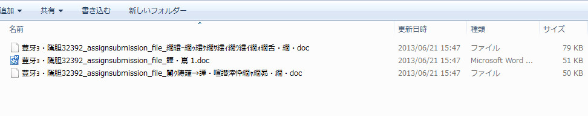
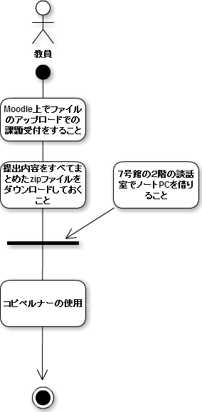

#コピペルナーV3運用マニュアル

#コピペルナーV3を使用するにあたっての注意事項

- コピペルナーV3でのコピペ判定結果はあくまでも目安として扱ってください。
- レポート出題時に、以下の拡張子のファイル形式以外での提出をされた場合には、コピペルナーの解析ができません。
- Microsoft Office Word（*doc, *.docx, *docm)  
- Microsoft Office Excel(*.xls, *.xlsx, *.xlsm)  
- Microsoft Office PowerPoint(*.ppt, *.pptx, *pptm)  
- Adobe PDF(*.pdf)、テキスト形式(*.txt)  
- HTMLファイル(*.html, *.htm)  

##課題内容zip解凍後の文字化け対処方法について
提出内容をすべてまとめたzipファイルをmoodle上でダウンロードしてファイルを解凍した際、
LMS内でのファイル名はUTF-8のため、Windowsの場合
こういった文字化けをしてしまいます。
文字化けを防ぐためには、『7-zip』(http://www.7-zip.org)
というフリーの圧縮解凍ソフトを使って解凍をすれば文字化けせずに
ファイルを解凍できます。
インストールの手順はこのサイトに解説があります。
(http://www.lzh-zip.com/freesoft/free127.html)

##コピペルナーV3を使う前にしておくこと
  

- ファイルのアップロードでの課題受付をする  
1.Moodle上で右上にある「編集モードの開始」ボタンを押す。  
2.右下の+のアイコンをクリックする。  
3.「活動またはリソースを追加する」のとこから「課題」を追加  
4.課題内容を設定して課題の受付をする。  
- 提出内容を全部まとめたzipファイルをダウンロードしておく  
1.Moodle上で出題した課題のトピックにいき、「すべての提出を表示/評定する」をクリック。  
2.上の評定操作から「すべての提出をダウンロードする」を選択  
3.提出されたファイルがまとまったzipファイルがダウンロードできる。  
- ７号館の２階の談話室でノートPCを借りる  

 - コピペルナーがインストールされているノートＰＣ：
001,002,PC-06,PC-07,PC-08

##コピペルナーを起動するまでの手順
1.ノートＰＣを「ゲスト」でログオンする。  
2.ノートＰＣを、有線ＬＡＮをノートＰＣにつなぐ、無線ＬＡＮを使用する場合は、ＩＥやGoogle chromeなどを立ち上げて、ICCにログインして、インターネット接続可能な状態にする。  
3.デスクトップのコピペルナーＶ３のアイコンをダブルクリックしてコピペルナーV3を起動する。  
 
## コピペルナーでできること
- レポートや論文などの文書ファイルと、インターネット上にあるＷｅｂサイトやほかの文書ファイルと比較し、コピペのチェック
- 過去のレポートや判定済みのレポート同士のコピペチェック

## コピペルナーの使い方
1.コピペルナーが起動したらコピペ判定をはじめるをクリック  
2.コピペ判定したいファイルをダブルクリックまたはクリックしてファイルを追加をクリックし、次へをクリック  
3.最初はキーワード自動検索にチェックがついています。そのまま解析開始のボタンを押すと、レポートの内容に
関係のありそうなキーワードを自動検出し、そのキーワードに関係するサイトの情報を収集します。  
また、キーワードを任意で設定したい場合は、キーワード自動検索のチェックを外し、キーワード任意設定の場所に
キーワードを入力し、解析開始ボタンをクリックします。

## コピペルナーでの処理後のコピペ状況チェック手順
1.コピペ判定が出た文章をクリックで比較対象ドキュメントを確認  
2.サイトの文章とレポートの文章を見比べてコピペしているかチェックする  
## 判定の結果を成績評価に加える場合
- しっかりと引用の作法を用いてレポートが書かれている場合には減点はしない。
- コピペの割合が極端に多いレポートに関しては減点をする。
